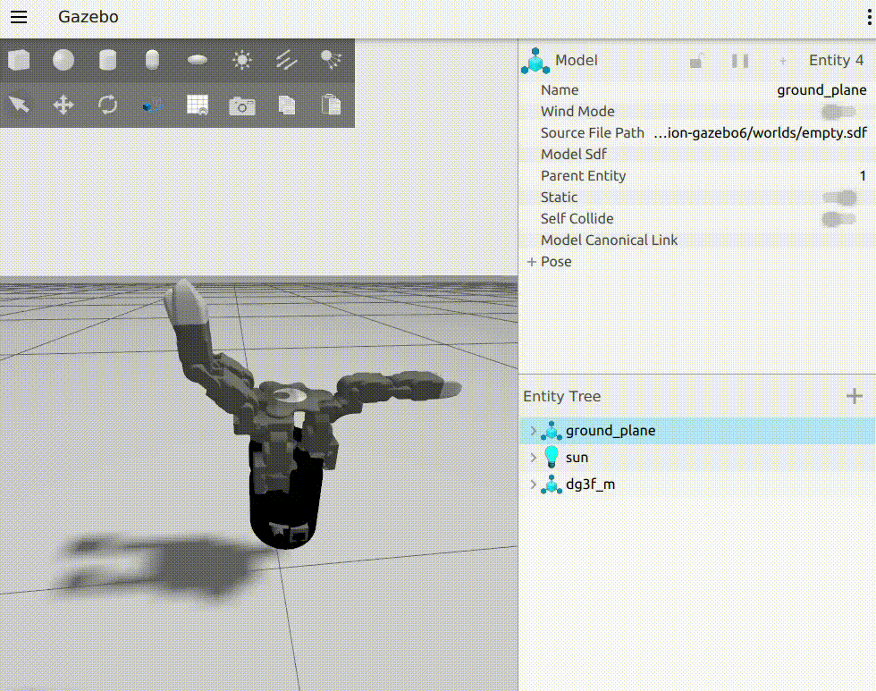

# dg4f_gz ROS 2 Package 🚀

## 📌 Overview

It provides detailed Gazebo simulations of the Delto Gripper-4F using [ROS 2 control joint trajectory controllers](https://control.ros.org/rolling/index).


## 📦 How to Install Dependencies for a Single ROS2 Package (`dg4f_gz`) Using rosdep

Follow these steps to install dependencies specifically for the `dg4f_gz` package only, excluding other packages in your workspace.

### 1️⃣ Navigate to the workspace root

```bash
cd ~/your_ws
```

### 2️⃣ Update rosdep (without sudo)

```bash
sudo apt update
rosdep update
```

> ⚠️ **Important:** Do **not** use `sudo` when running `rosdep update`.

### 3️⃣ Install dependencies only for the specific package (`dg4f_gz`)

```bash
rosdep install --from-paths src/tesollo_ros2/dg4f_ros2/dg4f_gz --ignore-src -r -y
```

- `--from-paths`: Limits dependency checking to the specified path
- `--ignore-src`: Ignores packages already present in your workspace
- `-r`: Recursively checks dependencies within subdirectories
- `-y`: Automatically confirms installation of dependencies

---

## ✅ Verify Installation by Building the Package

After installing dependencies, confirm the package builds successfully:

```bash
colcon build --packages-select dg4f_gz
```

This command builds only the `dg4f_gz` package, ensuring it compiles correctly.


## 🎮 Simulation Usage



Below are detailed instructions for launching the Delto Gripper-4F simulation and executing control commands using ROS 2 Control.


## 🎛️ Controlling Delto Gripper-4F

### 1\. Loading a URDF model into Gazebo

Launch the Delto Gripper-4F simulation with:
```bash
ros2 launch dg4f_gz dg4f_gz.launch.py
```

This command initializes Gazebo, loads the specified URDF robot description, and activates all necessary ROS 2 control plugins.

### 2\. Sending control commands using ROS 2 Control

-  **Python Example**: [dg4f_gz_test.py](script/dg4f_gz_test.py)

Run the Python test script:
```bash
ros2 run dg4f_gz dg4f_gz_test.py
```

- 💻 **C++ Example**: [dg4f_gz_test.cpp](src/dg4f_gz_test.cpp)

Execute the C++ test node:
```bash
ros2 run dg4f_gz dg4f_gz_test_cpp
```

## 🤝 Contributing

Contributions are highly encouraged and greatly appreciated. To contribute:

1. Fork this repository.
2. Create a new branch (`git checkout -b feature/my-feature`).
3. Commit your changes (`git commit -am 'Add my feature'`).
4. Push to your branch (`git push origin feature/my-feature`).
5. Open a pull request detailing your modifications.


## 📄 License

This project is released under the BSD-3-Clause license, promoting open-source collaboration and reuse.


## 📧 Contact

For additional support or inquiries about this package, please contact [TESOLLO SUPPORT](mailto:support@tesollo.com).
